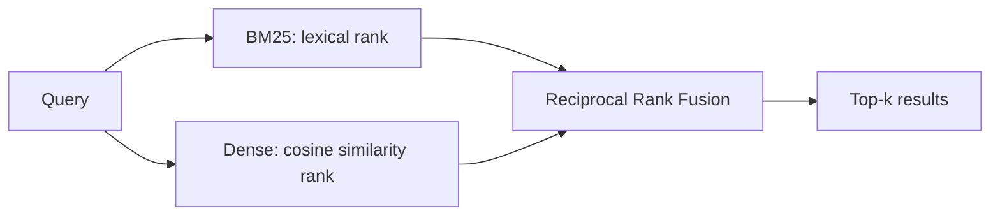

<div align="center">


[](https://github.com/vitormigli/hybrid-search-ptbr/actions/workflows/ci.yml)


</div>

Hybrid (BM25 + dense embeddings, fused with RRF) semantic search over Portuguese
documents — runs entirely on local compute, no LLM API involved.

## Demo

```bash
docker compose up
```

Then query it: `curl "http://localhost:8000/search?q=quantos+dias+de+ferias+eu+tenho&mode=hybrid"`

## Architecture



## Results

15 gold queries against a 15-document synthetic policy corpus. Full breakdown in
[`evals/results.md`](evals/results.md).

| Mode | Recall@3 | Recall@5 | MRR |
|---|---|---|---|
| BM25 only | 76.7% | 90.0% | 0.802 |
| Dense only | 96.7% | 100.0% | 1.000 |
| Hybrid (RRF) | 90.0% | 100.0% | 0.883 |

Dense retrieval alone beat the hybrid fusion here — on this small, paraphrase-heavy
query set (natural-language questions rarely sharing exact keywords with the policy
text), BM25's weaker rankings pulled the RRF-fused result down rather than helping.
RRF earns its keep on corpora and queries where lexical and semantic signals disagree
in complementary ways; here they mostly agreed, and BM25 was just noisier when they
didn't. Included as-is rather than cherry-picking a corpus where hybrid wins by
construction.


## Technical decisions and trade-offs

- **RRF fusion instead of score normalization**: BM25 and cosine-similarity scores
  live on incompatible scales; RRF only uses rank position, sidestepping that
  entirely. Details in [`docs/decisions/0001-rrf-fusion.md`](docs/decisions/0001-rrf-fusion.md).
- **`sentence-transformers` multilingual MiniLM, no vector database**: the corpus is
  small enough that brute-force cosine similarity in memory is instant; a vector DB
  would be premature here but is a drop-in swap (`DenseRetriever` is the seam).
- **Zero paid API calls**: the only network access this project makes is downloading
  open model weights once (cached after that) — it was built to be free to run and
  free to re-run.

## How to run

```bash
docker compose up
```

Or locally with [`uv`](https://docs.astral.sh/uv/):

```bash
uv sync
make test   # unit tests (BM25, RRF, metrics — fake embedder, no download)
make eval   # downloads the embedding model once (~470MB), then runs the eval
make run    # starts the search API
make lint
```

## Limitations and next steps

- Small synthetic corpus (15 docs, 15 queries) — designed as the retrieval backbone
  to reuse for a larger real corpus (e.g. public regulatory text) later.
- No re-ranking step (e.g. a cross-encoder) after fusion — the natural next
  improvement if hybrid alone isn't accurate enough on a harder corpus.
- Single fixed embedding model; no comparison across embedding models yet.

## Resumo em português

Motor de busca híbrida (BM25 + embeddings, com fusão por RRF) sobre documentos em
português, rodando inteiramente em recursos locais — sem nenhuma chamada a API de LLM.
O eval compara busca só léxica, só vetorial e híbrida em recall@k e MRR sobre um
corpus sintético de políticas internas. Feito pra ser gratuito de rodar e de rodar de
novo, e reaproveitável como base de recuperação para um RAG maior no futuro.
